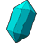
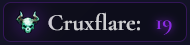

# How to Play: Shadows of the Deck

**Goal:** Collect all 7 golden fragments before the dream collapses.  
**Game Type:** Deck-building strategy game  
**Time:** 10-20 minutes per game  

---

## What is Deck-Building?

If you've never played a deck-building game before: you start with a small deck of basic cards, then gradually buy better cards to add to your deck. Think of it like upgrading your toolkit - you begin with simple tools and work your way up to powerful equipment.

Your deck represents your abilities in the dream world. Better cards = more options and power.

---

## Quick Start (TL;DR)

1. **Play Focus cards**  → get orbs (money)
2. **Buy better cards** from the market → stronger deck
3. **Play Move cards**  → travel to collect fragments 
4. **Avoid the countdown**  → game ends when Cruxflare deck runs out  
5. **Win:** Get all 7 fragments before time runs out

---

## Your Starting Situation

**Your Deck (10 cards):**
- 7× Focus +1 🎯 (gives 1 orb each)
- 3× Move +1 👣 (moves 1 space each)

**Your Resources:**
- 3 orbs to spend
- Hand of 5 cards
- Standing at position 0 on the map

**The Map:**
- 18 positions (0 through 17)
- 7 fragments scattered across positions 2, 5, 7, 10, 12, 15, 17
- Some positions have encounters (random events)

---

## Understanding the Game Screen

### The HUD (Top Bar)
- **🎯 Orbs:** Your currency for buying cards
- **💎 Fragments:** How many you've collected (need 7 to win)
- **⚡ Cruxflare:** Countdown timer (starts at 19, you lose at 0)

### Your Hand (Bottom)
Cards you can currently play. Click any card to use it immediately.

### The Market (Middle)
5 cards available for purchase using your orbs. Better cards cost more but do more.

### The Dream Map
- **Cyan dot:** Your position
- **💎 Golden dots:** Fragment locations
- **💫 Purple dots:** Encounter zones (random events)

---

## How Each Turn Works

### 1. Play Your Cards
- **Focus cards** 🎯: Give you orbs to spend
- **Move cards** 👣: Advance you on the map
- **Special cards**: Various powerful effects

**Strategy tip:** Usually play all your Focus cards first to see how many orbs you have, then decide on movement.

### 2. Buy from Market (Optional)
- Spend orbs on new cards
- Purchased cards go to your discard pile
- They'll be available in future hands when your deck reshuffles

**Strategy tip:** Early game, prioritize better Focus cards to generate more orbs later.

### 3. End Turn
- Any remaining cards in hand are discarded
- Draw 5 new cards for next turn
- **Cruxflare event happens** (usually bad for you)

---

## Key Concepts for New Players

### Deck Cycling
- Your deck starts with 10 cards
- When you run out of cards to draw, your discard pile becomes your new deck
- This means cards you buy will eventually come back to your hand

### The Cruxflare Threat
The purple counter in your HUD shows how many "bad events" are left. Each turn, one happens:
- Dead cards added to your deck (clutter)
- Market cards removed
- Map nodes collapsed
- Other nasty effects

**Important:** This is your real enemy, not just a timer!

### Encounters vs Safe Movement
- **Regular Move cards** 👣: Trigger encounters on purple nodes (risk/reward)
- **Safe Move cards** 🌀: Skip encounters entirely (more expensive but safer)

---

## Your First Few Turns (Walkthrough)

### Turn 1
1. **Play all Focus cards** in your hand (likely 2-3 cards) → gain 2-3 orbs
2. **Look at the market** - with ~5 total orbs, you can afford:
   - Focus +2 (3 orbs) - gives you better orb generation
   - Move +1 (2 orbs) - more movement options
3. **Consider movement** - you probably have 1-2 Move cards
4. **Recommendation:** Buy Focus +2 to improve your economy, save movement for turn 2

### Turn 2
1. **Play Focus cards** → should have more orbs now
2. **Start moving** toward the nearest fragment (position 2)
3. **Buy more cards** based on your strategy

### Turn 3+
- Balance buying power cards vs making progress on the map
- Watch the Cruxflare counter - don't wait too long to start collecting fragments!

---

<h2>Card Types Reference</h2>

<h3>Basic Cards</h3>
<table>
  <thead>
    <tr>
      <th>Card</th>
      <th>Effect</th>
      <th>Cost</th>
      <th>Strategy</th>
    </tr>
  </thead>
  <tbody>
    <tr>
      <td>Focus +1 🎯</td>
      <td>+1 orb</td>
      <td>Starting card</td>
      <td>Your basic economy</td>
    </tr>
    <tr>
      <td>Focus +2 🎯</td>
      <td>+2 orbs</td>
      <td>3 orbs</td>
      <td>Early upgrade priority</td>
    </tr>
    <tr>
      <td>Focus +3 🎯</td>
      <td>+3 orbs</td>
      <td>5 orbs</td>
      <td>Mid-game economy</td>
    </tr>
    <tr>
      <td>Move +1 👣</td>
      <td>Move 1 space</td>
      <td>2 orbs</td>
      <td>Basic movement</td>
    </tr>
    <tr>
      <td>Move +2 👣</td>
      <td>Move 2 spaces</td>
      <td>4 orbs</td>
      <td>Efficient travel</td>
    </tr>
    <tr>
      <td>Move +3 👣</td>
      <td>Move 3 spaces</td>
      <td>6 orbs</td>
      <td>Efficient travel</td>
    </tr>
  </tbody>
</table>

<h3>Special Cards</h3>
<table>
  <thead>
    <tr>
      <th>Card</th>
      <th>Effect</th>
      <th>Cost</th>
      <th>When to Buy</th>
    </tr>
  </thead>
  <tbody>
    <tr>
      <td>Swift Step 🌀</td>
      <td>Move 1 safely</td>
      <td>3 orbs</td>
      <td>When encounters are risky</td>
    </tr>
    <tr>
      <td>Shadow Blocker 🛡️</td>
      <td>Block next Cruxflare</td>
      <td>4 orbs</td>
      <td>When countdown is low</td>
    </tr>
    <tr>
      <td>Dream Sight 🔮</td>
      <td>Preview next Cruxflare</td>
      <td>4 orbs</td>
      <td>For planning ahead</td>
    </tr>
    <tr>
      <td>Fragment 2pts 💎</td>
      <td>Next fragment = 2 points</td>
      <td>5 orbs</td>
      <td>Late game efficiency</td>
    </tr>
  </tbody>
</table>

---

## Strategy Tips

### Early Game (Turns 1-6)
- **Focus on economy:** Buy better Focus cards
- **Don't rush movement:** Build your deck first
- **Avoid expensive cards:** Stick to 2-4 orb purchases

### Mid Game (Turns 7-12)
- **Start collecting fragments:** Move toward positions 2, 5, 7
- **Buy defensive cards:** Shadow Blockers become important
- **Consider safe movement:** Encounters can slow you down

### Late Game (Turns 13+)
- **Fragment rush:** Use efficient movement and Fragment 2pts cards
- **Defensive focus:** Block Cruxflare effects when possible
- **Calculate carefully:** Make sure you can reach all remaining fragments

---

## Common Questions

**Q: Do I have to use all my cards each turn?**  
A: No, but usually you want to. Unused cards just get discarded anyway.

**Q: When should I start moving toward fragments?**  
A: Around turn 3-5, once you have better orb generation.

**Q: What if I land on an encounter?**  
A: You'll either gain 2-4 orbs (60% chance) or lose 1-2 orbs (40% chance). It's usually worth the risk early game.

**Q: Can I win without buying expensive cards?**  
A: Possible but harder. Better cards give you more options and efficiency.

**Q: What happens if the Cruxflare deck runs out?**  
A: You lose immediately, regardless of how many fragments you have.

---

## Quick Reference

**Win Condition:** Collect all 7 fragments  
**Lose Condition:** Cruxflare deck empties (counter reaches 0)  
**Fragment Locations:** Positions 2, 5, 7, 10, 12, 15, 17  
**Hand Size:** Always 5 cards  
**Starting Resources:** 3 orbs, 10-card deck  

**Essential Strategy:** Balance economy building with map progress while managing the Cruxflare cou
